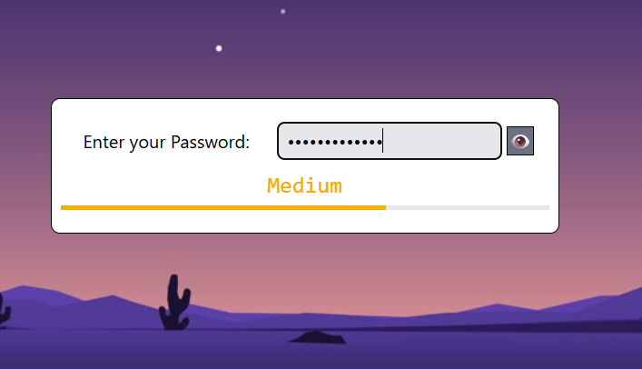
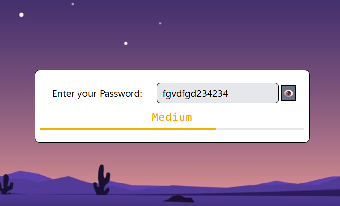
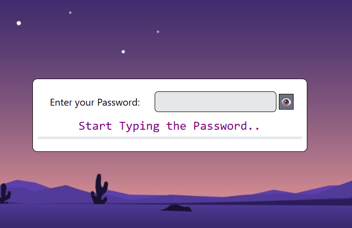
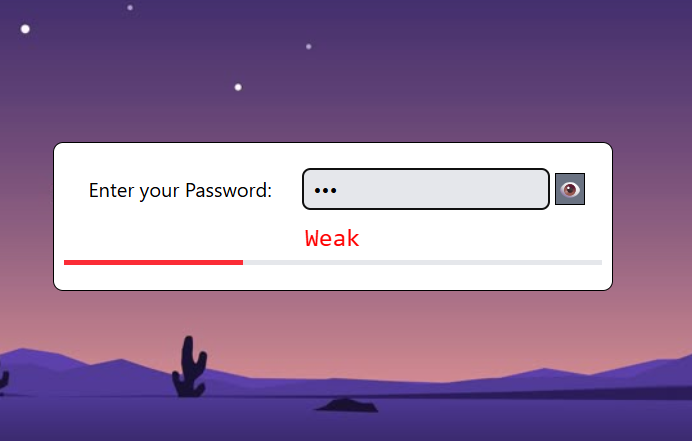
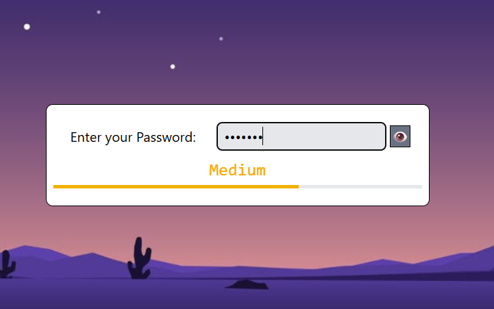
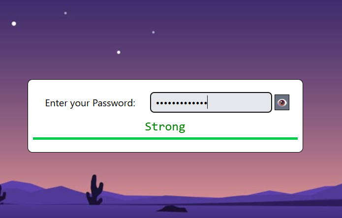

# Output:

- ## Hide Password :

- ## Show Password :

- ## When Nothing is typed :

- ## When Weak strength passwords are typed :

- ## When Medium strength passwords are typed : 

- ## When Strong strength Passwords are typed :
